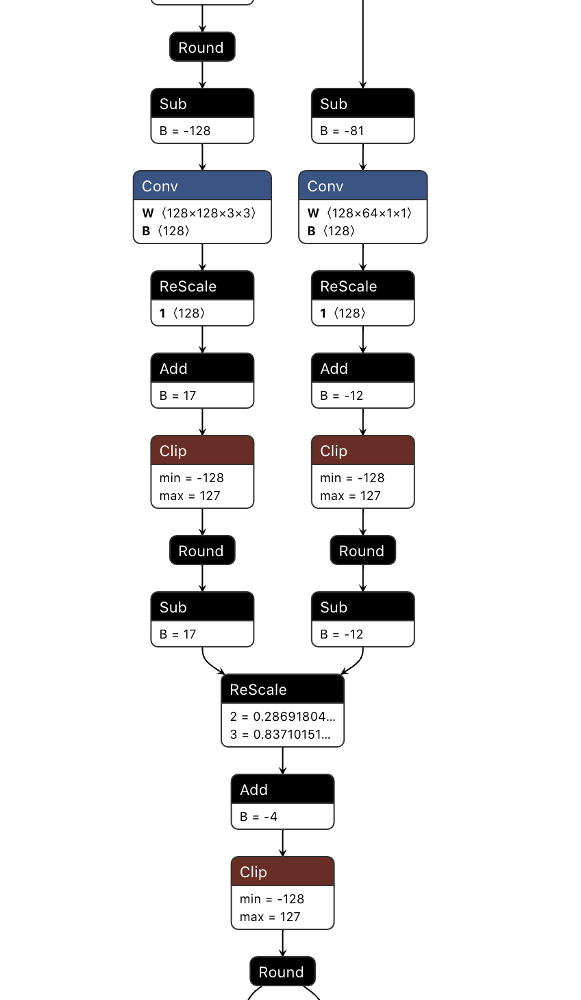

# TorchQuanter

TorchQuanter is designed to quantize pytorch model.

## Install
```
pip install -e .
```

## Quantization specification
```python
signed
    True:  int8
    False: uint8

symmetric_weight:
    True: int8, zero_point=0

qmode:
    per_tensor:
        * "module weights share the same scale and zero_point"

    per_channel: 
        * "each output channel of module weights has a scale and a zero_point"
        * support op: Conv, Depthwise-conv
```

## Support operations
```
Conv2d, Conv2d + BatchNorm2d + ReLU
Linear, Linear + ReLU
ReLU
MaxPool2d
```

## Support Export ONNX
Export onnx demo can be found in [examples/ptq/ptq.py](examples/ptq/ptq.py)

